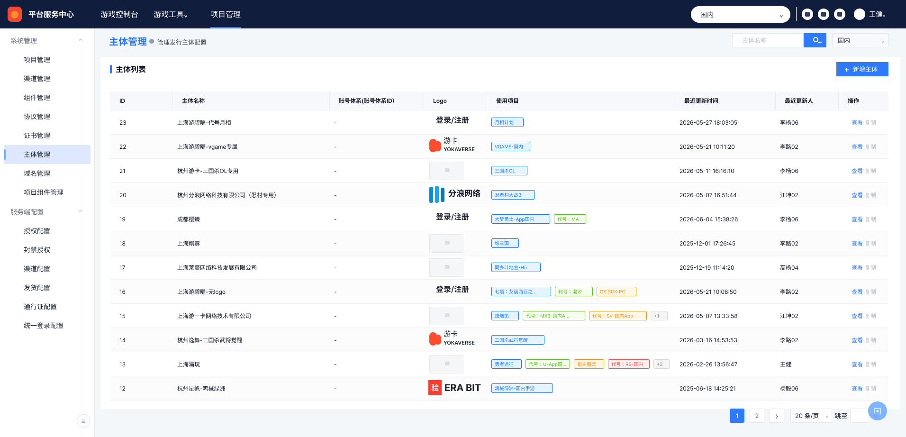
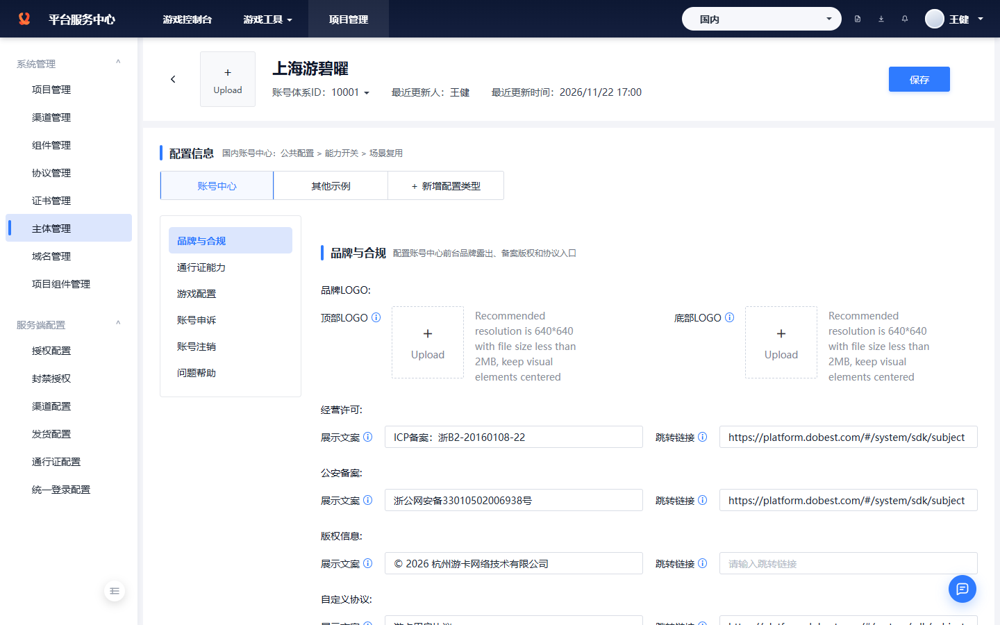
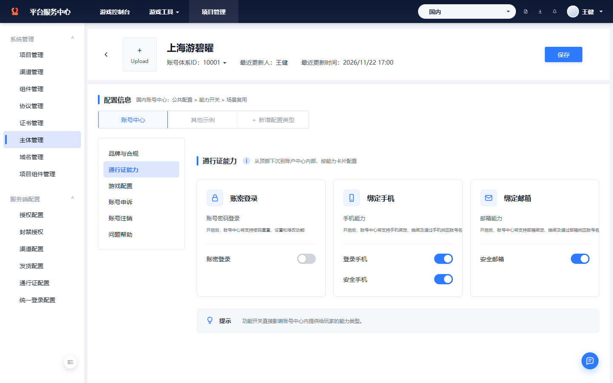
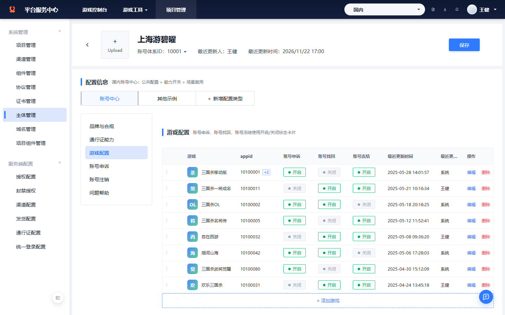
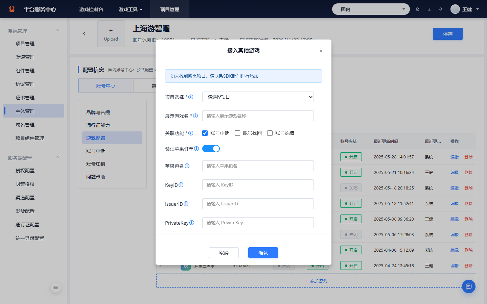
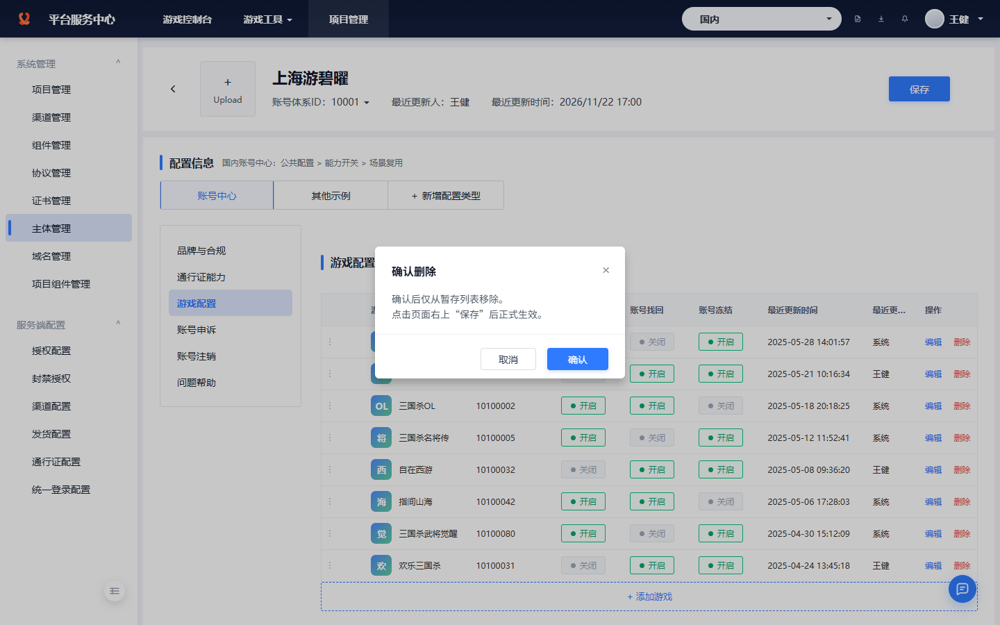
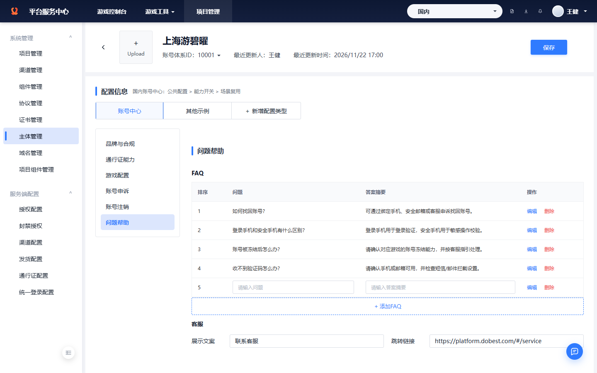

# 账号中心配置后台-需求文档

> 当前文档基于本地高保真原型与最新评审反馈整理。原型入口为 `prototype/account-center-config/index.html`，线上 Pages 入口为 `https://erduo85-source.github.io/account_center_config/prototype/account-center-config/`，验证截图统一存放在 `evidence/prototype/`。

## 一、需求背景

原有问题：账号中心相关配置分散在主体信息、能力标签、游戏能力、协议入口等多个位置，配置人员难以明确“当前主体下哪个能力在哪里配置”，评审时也难以围绕单个模块确认字段、交互和边界。

本期能力：在「主体管理」下新增账号中心配置详情页，以“主体详情 + 配置类型 Tab + 左侧二级菜单 + 右侧单模块配置”的方式承载品牌与合规、通行证能力、游戏配置、账号申诉、账号注销、问题帮助等能力。配置人员进入某个主体后，可按模块维护当前主体的账号中心配置，并通过页面右上角“保存”统一提交。

## 二、需求描述

### 1. 用户流程

1. 配置人员进入平台服务中心后台，当前一级导航为“项目管理”，左侧系统菜单选中“主体管理”。
2. 用户在主体管理列表页查看主体数据，可通过主体名称和项目筛选主体列表。
3. 用户点击主体列表操作列“查看”，在当前页面进入主体详情态，不新开页面。
4. 详情页顶部展示当前主体基础信息，包括返回图标、LOGO、主体名称、账号体系 ID、最近更新人、最近更新时间和“保存”按钮。
5. 用户在配置类型 Tab 中默认停留在“账号中心”。“其他示例”和“新增配置类型”当前仅保留入口，不支持点击配置。
6. 用户在账号中心左侧二级菜单中切换配置模块：
   - 品牌与合规
   - 通行证能力
   - 游戏配置
   - 账号申诉
   - 账号注销
   - 问题帮助
7. 用户在“品牌与合规”内维护顶部 LOGO、底部 LOGO、经营许可、公安备案、版权信息和自定义协议。
8. 用户在“通行证能力”内配置账密登录、绑定手机、绑定邮箱三类基础通行证能力开关。
9. 用户在“游戏配置”内查看游戏能力列表，可新增游戏、编辑游戏、删除游戏、拖拽排序，并配置账号申诉、账号找回、账号冻结能力状态。
10. 用户在“账号申诉”内维护申诉条款文案、跳转链接和申诉须知富文本内容。
11. 用户在“账号注销”内查看占位说明；当前不配置真实字段。
12. 用户在“问题帮助”内维护 FAQ 和客服入口，可新增 FAQ、编辑 FAQ、保存 FAQ、删除 FAQ、拖拽排序。
13. 用户完成当前页面调整后，点击右上角“保存”。保存按钮进入“保存中”状态，保存完成后 toast 提示“保存成功”。

流程判断逻辑：

| 判断项 | 逻辑 |
| --- | --- |
| 是否进入详情态 | 点击主体列表操作列“查看”后，在当前页面切换到主体详情态 |
| 返回主体列表 | 点击主体详情左上 chevron 图标返回主体列表 |
| 配置标题是否展示路径 | 不展示。主要操作区标题仅展示“配置信息”，不展示“国内账号中心：公共配置 > ...” |
| 二级菜单切换规则 | 点击二级菜单后，右侧只展示当前模块，不在同一页铺开全部模块 |
| 保存是否立即提交线上 | 当前为高保真原型，只模拟保存中和保存成功反馈，不提交真实服务端 |
| 开关是否立即保存 | 不立即保存。开关点击后只改变当前页面状态，由右上角“保存”统一提交 |
| 添加按钮是否一直展示 | 否。自定义协议达到 10 个后隐藏添加按钮；FAQ 达到 20 个后隐藏添加按钮 |
| 删除是否需要确认 | 需要。游戏配置和 FAQ 删除均需要二次确认 |
| 拖拽排序是否立即生效 | 拖拽后立即更新当前页面暂存顺序，并提示需要点击保存提交 |
| 未定义功能如何处理 | 新增主体、复制、新增配置类型、上传 LOGO 等首版未实现的功能禁用，不弹出无意义说明弹窗 |
| 账号注销字段如何处理 | 当前缺少真实业务规则，只展示占位说明，不编造字段 |
| 海外账号中心是否包含 | 当前只按国内账号中心收敛，不展开海外差异 |

### 2. 页面说明

#### 2.1 主体管理列表页

页面保持平台服务中心后台结构，包括顶部导航、左侧系统菜单、主体管理标题、筛选条件、主体列表和分页器。

界面截图：

顶部导航：

| 区域 | 展示说明 |
| --- | --- |
| 平台标识 | 展示平台服务中心品牌标识和名称 |
| 一级导航 | 展示“游戏控制台 / 游戏工具 / 项目管理”，其中“项目管理”为当前选中 |
| 地区选择 | 顶栏右侧展示“国内”下拉 |
| 用户信息 | 展示当前用户“王健” |

左侧菜单：

| 菜单组 | 展示说明 |
| --- | --- |
| 系统管理 | 项目管理、渠道管理、组件管理、协议管理、证书管理、主体管理、域名管理、项目组件管理 |
| 服务端配置 | 授权配置、封禁授权、渠道配置、发货配置、通行证配置、统一登录配置 |
| 选中态 | “主体管理”为当前选中 |

筛选条件包含：

| 字段 | 展示说明 |
| --- | --- |
| 主体名称 | 输入框，占位符“请输入主体名称” |
| 项目 | 下拉，默认展示“国内” |
| 查询 | 主按钮 |
| 重置 | 次按钮 |

主体列表字段：

| 字段 | 展示说明 |
| --- | --- |
| ID | 展示主体 ID |
| 主体名称 | 展示主体名称 |
| 账号体系(账号体系ID) | 展示账号体系及账号体系 ID |
| Logo | 展示主体 Logo 缩略标识 |
| 使用项目 | 展示当前主体关联项目 |
| 最近更新时间 | 展示最近更新时间 |
| 最近更新人 | 展示最近更新人 |
| 操作 | 展示“查看 / 复制”；“查看”可点击，“复制”首版禁用 |

列表默认值和边界说明：

| 项目 | 说明 |
| --- | --- |
| 默认页面 | 进入后台默认展示主体管理列表 |
| 新增主体 | 按钮展示但禁用，当前不实现新增主体 |
| 查看 | 点击后进入主体详情态 |
| 复制 | 按钮禁用，不触发弹窗 |
| 分页 | 展示页码、每页条数和跳页输入；原型不做真实分页请求 |

#### 2.2 主体详情框架

点击主体列表“查看”后，进入主体详情态。详情态仍处于当前后台框架中，不打开新页面。

界面截图：

主体详情顶部包含：

| 模块 | 功能说明 |
| --- | --- |
| 返回图标 | 左上 chevron，无边框，点击返回主体列表 |
| LOGO | 展示当前主体 LOGO 上传位样式 |
| 主体名称 | 展示“上海游碧曜” |
| 账号体系 ID | 展示“10001” |
| 最近更新人 | 展示“王健” |
| 最近更新时间 | 展示“2026/11/22 17:00” |
| 保存 | 页面右上主按钮，点击后模拟保存中和保存成功 |

配置区域包含：

| 模块 | 功能说明 |
| --- | --- |
| 配置标题 | 展示“配置信息”，左侧蓝色竖向强调条；标题后不展示路径描述 |
| 配置类型 Tabs | 展示“账号中心 / 其他示例 / + 新增配置类型” |
| 二级菜单 | 展示品牌与合规、通行证能力、游戏配置、账号申诉、账号注销、问题帮助 |
| 右侧内容区 | 根据二级菜单展示当前模块 |

配置类型状态：

| Tab | 状态说明 |
| --- | --- |
| 账号中心 | 默认选中，可展示下方二级菜单和配置内容 |
| 其他示例 | 禁用，仅保留样式 |
| + 新增配置类型 | 禁用，后续业务明确后再定义 |

#### 2.3 品牌与合规配置页

“品牌与合规”用于维护账号中心前台品牌露出、备案版权和协议入口。

界面截图：

页面模块：

| 模块 | 字段 | 说明 |
| --- | --- | --- |
| 品牌 LOGO | 顶部 LOGO、底部 LOGO | 展示上传位样式；首版不实现真实上传 |
| 经营许可 | 展示文案、跳转链接 | 支持输入 |
| 公安备案 | 展示文案、跳转链接 | 支持输入 |
| 版权信息 | 展示文案、跳转链接 | 支持输入 |
| 自定义协议 | 展示文案、跳转链接 | 支持添加多行 |

自定义协议规则：

| 项目 | 说明 |
| --- | --- |
| 初始数据 | 默认展示用户协议、隐私协议等协议行 |
| 添加入口 | 表单下方展示整行虚线按钮“+ 添加自定义协议” |
| 添加上限 | 最多允许 10 个自定义协议 |
| 达到上限 | 达到 10 个后隐藏“+ 添加自定义协议”按钮 |
| 输入内容 | 每行包含展示文案和跳转链接 |
| 保存方式 | 当前页面编辑后由右上角“保存”统一提交 |

#### 2.4 通行证能力配置页

“通行证能力”用于配置账号中心内基础账号能力，包括账密登录、绑定手机、绑定邮箱。

界面截图：

区域标题：

| 元素 | 展示说明 |
| --- | --- |
| 蓝色强调条 | 位于标题左侧 |
| 标题 | 展示“通行证能力” |
| 信息 icon | 标题旁展示 info icon |
| 辅助说明 | 展示“从顶部下沉到账户中心内部，按能力卡片配置” |
| 恢复默认 | 不展示 |

能力卡片：

| 卡片 | 说明文案 | 配置项 |
| --- | --- | --- |
| 账密登录 | 开启后，账号中心将支持密码重置、设置和修改功能 | 账密登录 |
| 绑定手机 | 开启后，账号中心将支持手机绑定、换绑及通过手机找回账号名 | 登录手机、安全手机 |
| 绑定邮箱 | 开启后，账号中心将支持邮箱绑定、换绑及通过邮箱找回账号名 | 安全邮箱 |

展示规则：

| 项目 | 说明 |
| --- | --- |
| 卡片数量 | 一行展示 3 张等宽卡片 |
| 图标 | 使用外部图标风格，尽量与设计稿一致 |
| 短副标题 | 不展示“账号密码登录 / 手机能力 / 邮箱能力” |
| 必选标签 | 不展示“必选”标签 |
| 开关 | 支持点击切换 |
| 保存 | 开关切换后不立即保存，由右上角保存统一提交 |

#### 2.5 游戏配置页

“游戏配置”用于维护当前账号中心内与账号申诉、账号找回、账号冻结相关的游戏能力配置。

界面截图：

列表字段：

| 字段 | 展示说明 |
| --- | --- |
| 顺序 | 展示拖拽手柄，支持拖拽排序 |
| 游戏 | 展示游戏图标和游戏名 |
| appid | 展示游戏 appid；多 appid 使用 `+N` 标签提示 |
| 账号申诉 | 展示开启/关闭状态卡片 |
| 账号找回 | 展示开启/关闭状态卡片 |
| 账号冻结 | 展示开启/关闭状态卡片 |
| 最近更新时间 | 展示最近更新时间 |
| 最近更新人 | 展示最近更新人 |
| 操作 | 支持编辑、删除 |

游戏列表交互：

| 场景 | 说明 |
| --- | --- |
| 添加游戏 | 点击底部“+ 添加游戏”打开游戏配置弹窗 |
| 编辑游戏 | 点击“编辑”打开编辑弹窗 |
| 删除游戏 | 点击“删除”打开二次确认弹窗 |
| 拖拽排序 | 拖拽首列手柄调整列表顺序，排序后提示需要保存 |
| 状态卡片 | 开启使用绿色状态，关闭使用灰色状态 |

添加/编辑游戏弹窗：

界面截图：

表单项：

| 字段 | 说明 |
| --- | --- |
| 顶部提示 | 展示“如未找到所需项目，请联系SDK部门进行添加” |
| 项目选择 | 下拉选择项目 |
| 展示游戏名 | 输入展示游戏名 |
| 关联功能 | 勾选账号申诉、账号找回、账号冻结 |
| 验证苹果订单 | 开关控制苹果验单配置项展示 |
| 苹果包名 | 开启验证苹果订单后展示 |
| KeyID | 开启验证苹果订单后展示 |
| IssuerID | 开启验证苹果订单后展示 |
| PrivateKey | 开启验证苹果订单后展示 |

苹果订单验证规则：

| 配置项 | 规则说明 |
| --- | --- |
| 验证苹果订单 | 开关默认开启或读取当前配置状态 |
| 关闭状态 | 隐藏苹果包名、KeyID、IssuerID、PrivateKey 四个输入项，弹窗高度自适应 |
| 开启状态 | 展示四个输入项 |
| 编辑态 | 读取当前行配置并允许修改 |
| 确认 | 点击“确认”回写当前页面暂存列表，不直接提交真实服务端 |

删除游戏二次确认：

界面截图：

| 场景 | 说明 |
| --- | --- |
| 触发条件 | 点击游戏配置列表操作列“删除” |
| 弹窗标题 | 确认删除 |
| 弹窗说明 | 确认后仅从当前暂存列表移除，保存后正式生效 |
| 次按钮 | 取消 |
| 主按钮 | 确认 |

#### 2.6 账号申诉配置页

“账号申诉”用于维护账号中心内申诉条款和申诉须知，不重复配置游戏能力。

页面模块：

| 模块 | 字段 | 说明 |
| --- | --- | --- |
| 申诉条款 | 展示文案 | 输入申诉条款名称 |
| 申诉条款 | 跳转链接 | 输入条款链接 |
| 申诉须知 | 富文本工具栏 | 展示加粗、斜体、下划线、链接、列表等编辑器样式 |
| 申诉须知 | 正文区域 | 展示可编辑内容区域样式 |

边界说明：

| 项目 | 说明 |
| --- | --- |
| 游戏配置 | 不在账号申诉页重复配置游戏列表 |
| 保存 | 由右上角“保存”统一提交 |
| 富文本 | 当前为原型样式，研发实现时需确认真实编辑器组件 |

#### 2.7 账号注销配置页

“账号注销”当前缺少真实业务字段，仅保留菜单和占位页。

页面状态：

| 项目 | 说明 |
| --- | --- |
| 页面内容 | 展示“账号注销配置待补充” |
| 说明文案 | 提示当前仅保留入口，不展示未确认字段 |
| 字段规则 | 不编造账号注销字段 |
| 后续动作 | 待业务规则明确后补充配置项 |

#### 2.8 问题帮助配置页

“问题帮助”用于维护账号中心 FAQ 和客服入口。FAQ 置顶，客服配置位于 FAQ 下方。

界面截图：

FAQ 列表字段：

| 字段 | 展示说明 |
| --- | --- |
| 顺序 | 展示拖拽手柄 |
| 排序 | 展示排序号 |
| 问题 | 展示 FAQ 问题 |
| 答案摘要 | 展示 FAQ 答案摘要 |
| 操作 | 展示编辑/删除；编辑态展示保存/删除 |

FAQ 交互规则：

| 场景 | 说明 |
| --- | --- |
| 添加 FAQ | 点击“+ 添加FAQ”新增一行空数据，并进入可输入状态 |
| 添加上限 | FAQ 最多允许 20 个 |
| 达到上限 | 达到 20 个后隐藏“+ 添加FAQ”按钮 |
| 编辑 FAQ | 点击“编辑”后，问题和答案摘要变为输入框 |
| 保存 FAQ | 编辑态下“编辑”按钮变为“保存”，点击后完成输入并退出编辑态 |
| 删除 FAQ | 点击“删除”打开二次确认弹窗 |
| 拖拽排序 | 拖拽首列手柄调整 FAQ 顺序，排序号自动重排 |

FAQ 删除二次确认：

| 场景 | 说明 |
| --- | --- |
| 触发条件 | 点击 FAQ 操作列“删除” |
| 弹窗标题 | 确认删除 |
| 提示文案 | 请确认是否删除该信息 |
| 次按钮 | 取消 |
| 主按钮 | 确认 |

客服入口：

| 字段 | 展示说明 |
| --- | --- |
| 展示文案 | 输入客服入口展示文案，默认“联系客服” |
| 跳转链接 | 输入客服跳转链接 |

#### 2.9 保存与反馈

页面右上角固定展示“保存”按钮。保存为当前高保真原型内的统一提交反馈，不接真实服务端。

保存状态：

| 场景 | 说明 |
| --- | --- |
| 默认态 | 按钮展示“保存” |
| 点击保存 | 按钮进入“保存中”状态 |
| 保存成功 | toast 提示“保存成功” |
| 保存失败 | 当前原型不模拟失败态，后续接入接口后补充 |

Toast 反馈：

| 场景 | 文案示例 |
| --- | --- |
| 保存成功 | 保存成功 |
| 开关切换 | 已更新当前页面状态，请点击保存提交 |
| 添加协议 | 已添加一行自定义协议 |
| 添加 FAQ | 已添加一行FAQ |
| 保存 FAQ | 已保存FAQ |
| 删除 FAQ | 已删除FAQ |
| 游戏排序 | 已更新游戏排序，请点击保存提交 |
| FAQ 排序 | 已更新FAQ排序，请点击保存提交 |

#### 2.10 已有数据说明

主体列表 mock 数据：

| 主体 ID | 主体名称 | 账号体系 | 使用项目 |
| --- | --- | --- | --- |
| 10001 | 上海游碧曜-代号月相 | 游碧曜账号体系(10001) | 月相计划 |
| 10002 | 上海游碧曜-vgame专属 | 游碧曜账号体系(10001) | VGAME-国内 |
| 10003 | 杭州游卡-三国杀OL专用 | 游卡账号体系(10011) | 三国杀OL |
| 10004 | 杭州分浪网络科技有限公司（忍村专用） | 分浪账号体系(10021) | 忍村专用 |
| 10005 | 成都樱臻 | 樱臻账号体系(10031) | 大梦勇士-App国内 |

游戏配置 mock 数据：

| 游戏名 | appid |
| --- | --- |
| 三国杀移动版 | 10100001 |
| 三国杀一将成名 | 10100011 |
| 三国杀OL | 10100002 |
| 三国杀名将传 | 10100005 |
| 自在西游 | 10100032 |
| 指间山海 | 10100042 |
| 三国杀武将觉醒 | 10100080 |
| 欢乐三国杀 | 10100031 |

数据来源说明：

| 数据 | 来源 | 说明 |
| --- | --- | --- |
| 主体列表 | 主体管理 mock 数据 | 用于列表展示和进入详情 |
| 主体详情 | 当前选中主体 mock 数据 | 用于顶部主体信息区展示 |
| 品牌与合规 | 账号中心配置 mock 数据 | 用于 LOGO、备案、版权、协议入口展示 |
| 通行证能力 | 账号中心配置 mock 数据 | 用于能力卡片和开关状态 |
| 游戏配置 | 账号中心配置 mock 数据 | 用于游戏能力列表、弹窗和排序 |
| 账号申诉 | 账号中心配置 mock 数据 | 用于条款和富文本展示 |
| FAQ | 账号中心配置 mock 数据 | 用于问题帮助列表、编辑、删除、排序 |
| 最近更新时间 | mock 时间 | 原型中不随真实保存动态写入服务端 |
| 最近更新人 | mock 用户 | 当前统一展示“王健”或“系统”等示例值 |

### 3. 权限与边界说明

| 项目 | 说明 |
| --- | --- |
| 页面权限 | 当前原型不实现登录和权限控制 |
| 编辑权限 | 当前原型默认具备可编辑能力；禁用项代表业务未定义，不代表权限不足 |
| 真实接口 | 当前不接后端接口 |
| 真实保存 | 当前不写入数据库或服务端 |
| 审计日志 | 当前不记录真实操作日志 |
| 多地区 | 顶部展示“国内”，当前不实现地区切换后的数据隔离 |

### 4. 验收标准

| 场景 | 验收标准 |
| --- | --- |
| 主体列表 | 页面结构、筛选区、列表字段、分页和操作列展示完整 |
| 进入详情 | 点击“查看”后在当前页进入详情态，不新开页面 |
| 返回列表 | 点击左上 chevron 返回主体列表 |
| 配置标题 | 只展示“配置信息”，不展示路径描述 |
| 二级菜单 | 6 个菜单项顺序正确，切换后右侧只展示当前模块 |
| 品牌与合规 | 自定义协议最多 10 个，达到上限隐藏添加按钮 |
| 通行证能力 | 三张卡片展示长说明，不展示短副标题和“必选”标签；开关可点击 |
| 游戏配置 | 支持添加、编辑、删除二次确认、拖拽排序、苹果验单字段显隐 |
| 账号申诉 | 展示条款和富文本区域，不重复游戏配置 |
| 账号注销 | 只展示占位说明，不出现未确认字段 |
| 问题帮助 | FAQ 支持添加、编辑保存、删除确认、拖拽排序；最多 20 个后隐藏添加按钮 |
| 保存反馈 | 点击保存后展示保存中和保存成功反馈 |
| 视觉质量 | 无遮挡、错位、异常换行、跨列、按钮贴边、弹窗高度不适配 |

